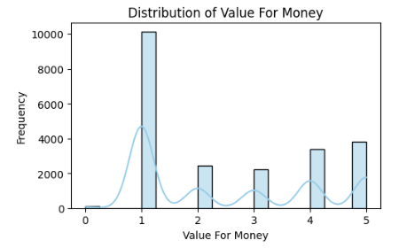
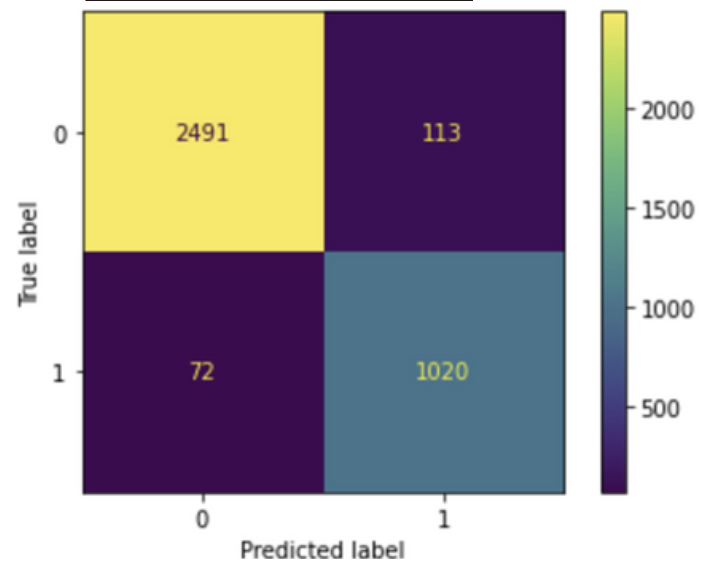

# Airline Reviews Analysis

## Overview
This project explores which aspects of a flight experience influence a customer's likelihood to recommend an airline. Using over 23,000 verified flight reviews from Kaggle, we applied Decision Tree and Random Forest models to classify customer recommendations based on various service and experience ratings.

Prepared by: Vy Nguyen, Dennis Wu, Kenjee Koh, Hsiang-Han Huang, Becky Wang

Key results include:
- Random Forest achieved 96.5% accuracy with full preprocessing and tuning
- "Value for Money", "Ground Service", and "Cabin Staff Service" were the top 3 drivers of customer recommendation

**Business Impact:** Our findings can guide airline strategy on service prioritization, customer experience investment, and pricing optimization.

## Dataset
- **Source:** Kaggle (originally scraped from airlinequality.com by Juhi Bhojani)  
- **Scope:** 23,171 verified airline reviews  
- **Size:** 23,171 records × 19 attributes  
- **Target Variable:** Whether a reviewer recommended the airline (Yes/No)  

### 📋 Data Dictionary

| Feature                 | Definition                                                             | Data Type     |
|-------------------------|------------------------------------------------------------------------|---------------|
| Value for Money         | Customer rating of price relative to experience                        | Numerical (1–5)|
| Ground Service          | Rating of service received at the airport                              | Numerical (1–5)|
| Cabin Staff Service     | Rating of crew friendliness and service quality                        | Numerical (1–5)|
| Seat Comfort            | Comfort level of the seating experience                                | Numerical (1–5)|
| Inflight Entertainment  | Availability and quality of onboard entertainment                      | Numerical (1–5)|
| Food & Beverages        | Quality of food and drinks served during the flight                    | Numerical (1–5)|
| Wifi & Connectivity     | Availability and reliability of onboard internet                       | Numerical (1–5)|
| Seat Type               | Type of seat class (e.g., Economy, Premium, Business, First)           | Categorical (encoded) |
| Type of Traveller       | Purpose of travel (e.g., Solo, Business, Family)                       | Categorical (encoded) |
| Recommended             | Whether the customer recommends the airline (target variable)          | Binary (0/1)   |

## Tools & Methodology Overview
**Languages and Libraries:** Python (pandas, numpy, matplotlib, seaborn, scikit-learn, imblearn)

### Data Preprocessing:
- Dropped irrelevant columns (e.g., Review Date, Text Review, Aircraft)
- Encoded categorical variables (`Seat Type`, `Type of Traveller`) using label encoding
- Filled missing rating values with neutral score (3.0)
- Dropped rows with unverified reviewers or missing non-rating data
- Balanced dataset using SMOTE to resolve target class imbalance
- Converted `Recommended` variable into binary format (Yes = 1, No = 0)

### Modeling Techniques:
- Trained Decision Tree and Random Forest classifiers
- Compared benchmark models (minimal preprocessing) and full models (enhanced cleaning + tuning)
- Applied hyperparameter tuning (GridSearchCV / RandomizedSearchCV)
- Evaluated feature importance to understand drivers of recommendation

### Evaluation Metrics:
- Accuracy, Precision, Recall, F1-score
- Confusion Matrix (class-specific performance)
- Feature Importance (model interpretation)

## Highlighted Visualizations

**Distribution of Value for Money:**

**Confusion Matrix (Random Forest):**

## Results & Key Insights

| Model                   | Accuracy | Precision | Recall | F1-Score |
|------------------------|----------|-----------|--------|----------|
| Baseline Decision Tree | 93.4%    | 92.8%     | 94.1%  | 93.4%    |
| Final Decision Tree    | 95.0%    | 94.7%     | 95.2%  | 95.0%    |
| Baseline Random Forest | 94.1%    | 93.5%     | 94.6%  | 94.0%    |
| Final Random Forest    | **96.5%**| **96.2%** | **96.7%** | **96.5%** |

- **Random Forest** with full preprocessing achieved the highest performance (96.5% accuracy)
- **Value for Money** was the most influential factor in determining customer satisfaction. Airlines should focus on promotional pricing, bundling, and loyalty rewards to optimize perceived value.
- **Ground Service** quality strongly affects recommendation likelihood. Improvements like smoother check-in, efficient baggage handling, and better airport support are key.
- **Cabin Staff Service** matters more in Decision Tree models than in Random Forest. While its impact is moderate, consistency and personalized support still contribute positively.
- **Seat Comfort** also emerged as a notable factor. Airlines may consider adding legroom, enhancing cushion quality, or offering adjustable seat features.

## Key Deliverables
- Jupyter Notebooks:
  - `Notebooks/Airline_Reviews_Preprocessing.ipynb`
  - `Notebooks/Airline_Reviews_Decision_Tree_Models.ipynb`
  - `Notebooks/Airline_Reviews_Random_Tree_Models.ipynb`
- Final Report PDF: `Reports/Airline_Reviews_Analysis_Project_Report.pdf`

## What I Learned
- Preprocessing and class balancing have major impact on model performance
- Label encoding works well for structured, ordinal-style categorical variables
- SMOTE enhances performance without overfitting on minority class
- Tree-based models are highly interpretable and improve significantly with tuning

## What I Plan to Improve
- Apply other ensemble models like XGBoost or Gradient Boosting for comparison
- Explore sentiment or topic modeling with the textual review data using NLP
- Integrate time-based analysis by leveraging review dates (e.g., trends over time)

## About Me
Hi, I’m Vy Nguyen and I’m currently pursuing my MS in Business Analytics at UC Irvine. I’m passionate about data analytics in Finance and Investment. Connect with me on [LinkedIn](https://www.linkedin.com/in/vy-ngoc-lan-nguyen).
